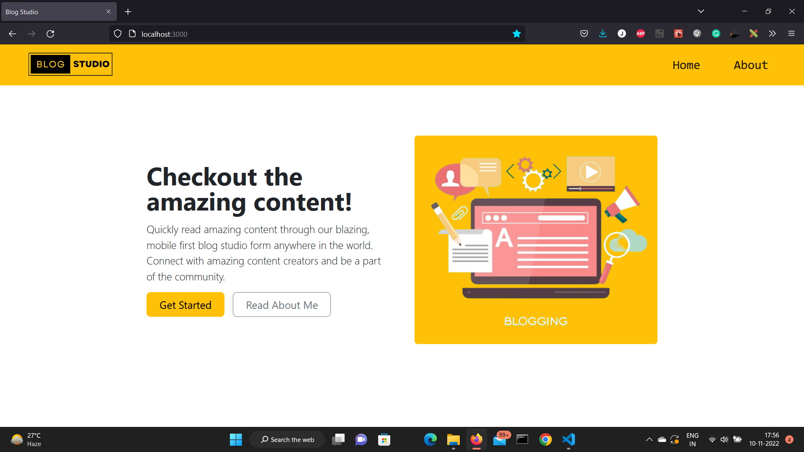

# Blog Studio

This is a sample blog app built using data from a dummy data third pary API service - <a href="https://dummyapi.io/">Dummy API</a>

### Application Overview

<ul>
<li>Home Page - Contains the landing page. It loads the posts from dummy api and give a preview of all those post. Further you can click on read more to see the post details</li>
<li>About Page - This page contains the information about the developer.</li>
<li>Post Page - When user clicks on read more on any post this page will open and it will load the post details from the dummy server according to the post id in the url params and display the details to the user.</li>
</ul>

The home page and the post page are completely dynamic no code is repeated and proper error handling has been done to ensure a better user experience.

### Technologies Used

The frontend is built using React with Webpack. I had used so many other libraries for this application. Some of the major among those are:

<ul>
<li>BootStrap - For UI framework</li>
<li>FontAwesome - For icons</li>
<li>React Router V6 - For routing setup</li>
<li>MomentJs - For date formatting</li>
<li>React Toastify - For realtime error popups</li>
<li>Lodash - For some common tasks</li>
</ul>

### How to run or build the application

To run the application you need to set up nodejs and npm on your machine. <a href="https://www.tutorialspoint.com/nodejs/nodejs_environment_setup.htm">Setup NodeJs and NPM</a>

Once you successfully setup nodejs and npm. Clone the repository to your local machine and follow the below setps.

<ul>
<li>Open terminal in the project root folder and run command - npm install (Wait until it completes installing)</li>
<li>To run in dev mode run command - npm run dev (Project will automatically open in default browser. If it does not open you can check at - http://localhost:3000 in any browser)</li>
<li>To make a build run command - npm run build (Build will be created in dist folder)</li>
</ul>

If you face any difficulty in running the application you can react out to me through the below given channels
### Author:

Name - Puneet Karamchandani
Email - jkaramchandani32@gmail.com
Mobile No. - +91 - 637 785 5204
